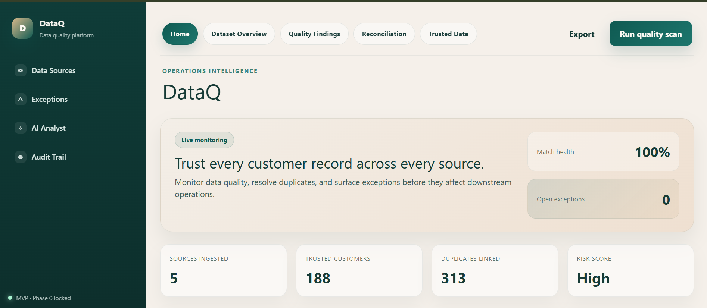
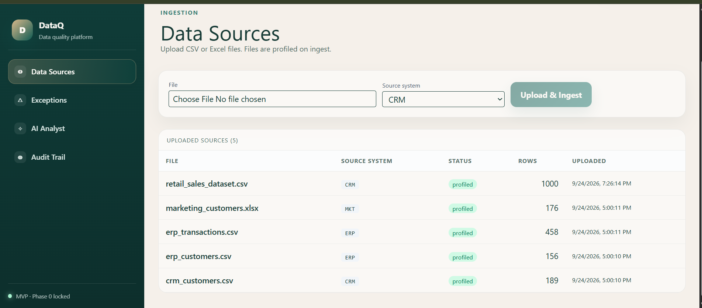
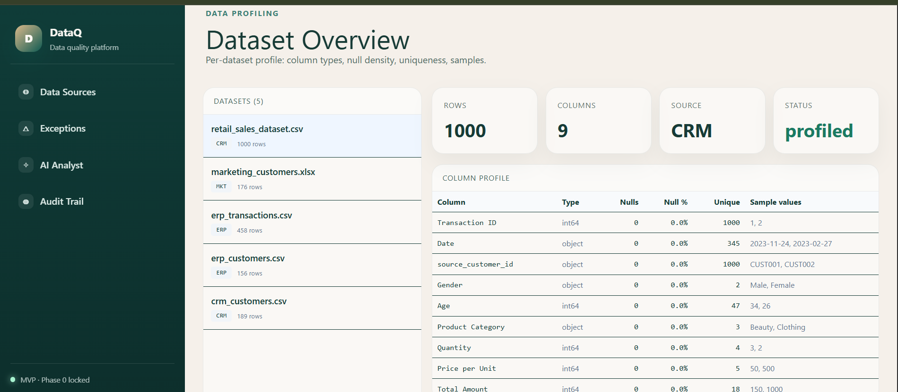
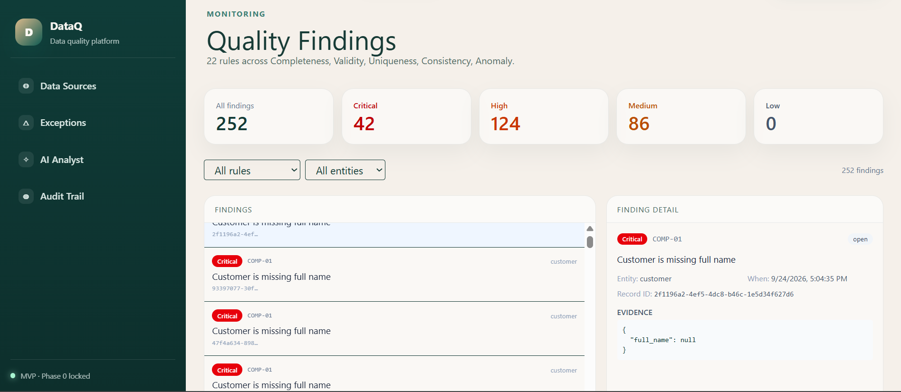
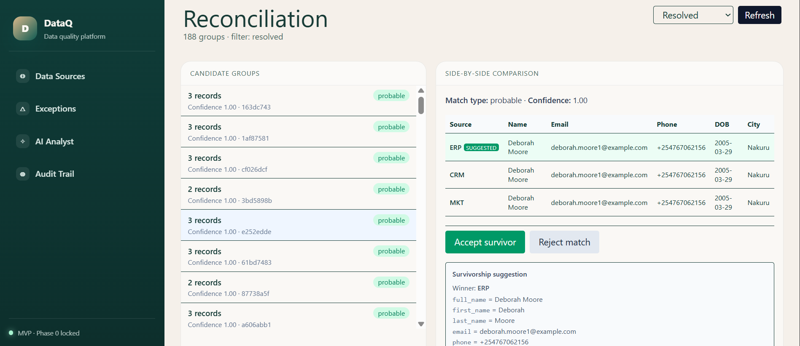
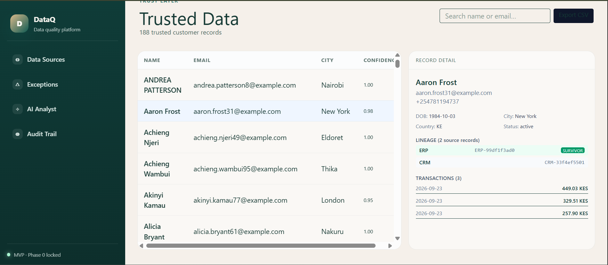
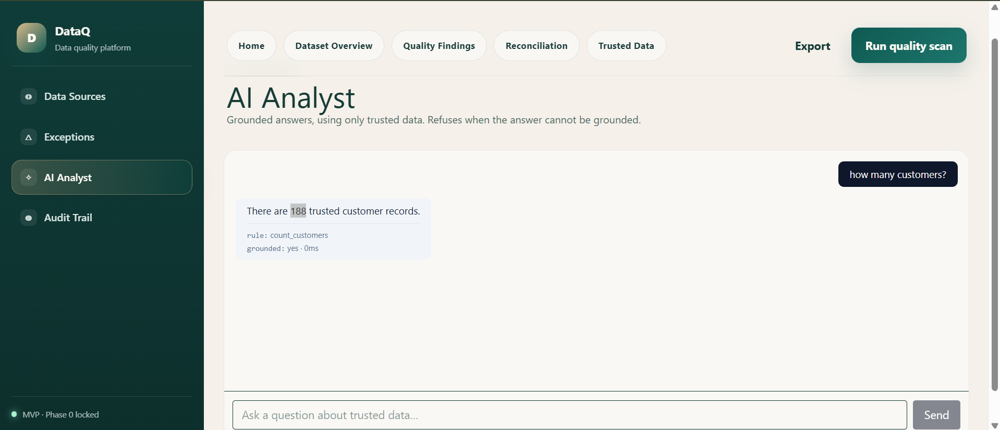
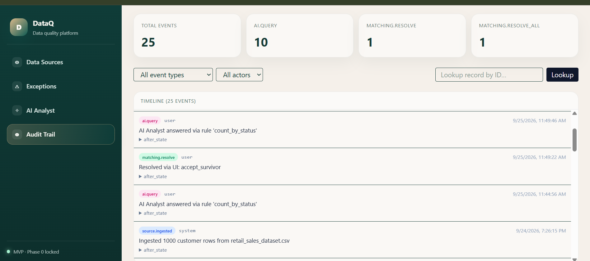
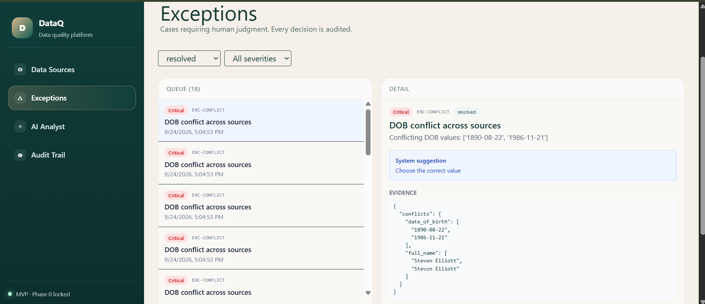
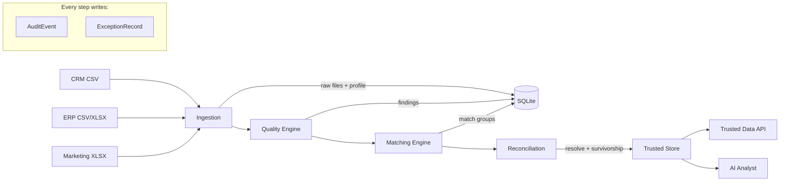

# DataQ

**Intelligent data quality, reconciliation and analytics platform.**

Ingests customer data from CRM, ERP, and marketing systems, runs 22 rule-based quality checks, matches duplicates with fuzzy entity resolution, resolves conflicts through rule-based survivorship, and produces an audit-ready trusted dataset with full lineage.

Turns messy multi-source data into trusted, explainable and audit-ready information.

Built end-to-end from a locked **Phase 0 Specification Pack** (personas, journeys, data model, quality rules, matching thresholds, exception workflows, evaluation metrics, and acceptance criteria) before any code was written.

---

## What It Does

DataQ takes messy, conflicting, multi-source customer data and turns it into a single trusted dataset — while proving every decision that produced it.

**Pipeline:**

1. **Ingests** raw customer and transaction files from multiple sources  
2. **Profiles** each file (dtype, nulls, uniqueness, samples)  
3. **Detects** data quality issues via 22 rules across five dimensions  
4. **Matches** records across sources with fuzzy entity resolution  
5. **Consolidates** pairwise matches into single multi-member groups (union-find)  
6. **Reconciles** conflicts using rule-based survivorship  
7. **Exposes** a trusted dataset with full source lineage  
8. **Answers** business questions via an AI Analyst grounded only on trusted data  
9. **Logs** every state change to an immutable audit trail  

---

## Highlights

- **22 data quality rules** across Completeness, Validity, Uniqueness, Consistency, Anomaly
- **Fuzzy entity matching** using Jaro-Winkler + Token Sort with a weighted composite score
- **Transitive consolidation** (union-find) so three pairwise matches become one 3-member group
- **Rule-based survivorship** (ERP > CRM > MKT priority, plus field-level rules)
- **Grounded AI Analyst** — answers only from trusted data, refuses when data is insufficient
- **Immutable audit trail** — every upload, ingest, quality run, match decision, and AI query is logged
- **State machine** — Raw → Profiled → Quality Checked → Matching → In Review → Trusted → Archived

---

## Screenshots

### Home — Live pipeline KPIs



### Data Sources — Upload, profile, and ingest



### Dataset Overview — Per-column profiling



### Quality Findings — 22 rules across 5 dimensions



### Reconciliation — Side-by-side comparison with survivorship



### Trusted Data — Full lineage + linked transactions



### AI Analyst — Grounded answers, refuses when ungrounded



### Audit Trail — Immutable event history



### Exceptions — Human-in-the-loop queue


## Architecture



Full component breakdown: [docs/ARCHITECTURE.md](docs/ARCHITECTURE.md)

---

## Tech Stack

| Layer    | Choice                                                              |
|----------|---------------------------------------------------------------------|
| Backend  | Python 3.12, FastAPI, SQLAlchemy 2.0                                |
| Database | SQLite (MVP), PostgreSQL-ready schema                               |
| Data     | pandas, openpyxl                                                    |
| Matching | rapidfuzz (Jaro-Winkler, Token Sort, Token Set)                     |
| ML-ready | scikit-learn (Isolation Forest planned); MVP baseline is rule-based |
| Frontend | React + Vite + TypeScript + Tailwind                                |
| Testing  | pytest, pytest-asyncio                                              |

**Source Priority (Locked):** ERP > CRM > Marketing  
**Roles (MVP):** Steward-only

---

## Quick Start

### Backend

```bash
cd backend
python -m venv venv

# Windows
venv\Scripts\Activate.ps1
# macOS / Linux
source venv/bin/activate

pip install -r requirements.txt
pip install faker
uvicorn api.main:app --reload --port 8000
```

Open http://localhost:8000/docs for the interactive API.

### Frontend (optional)

```bash
cd frontend
npm install
npm install -D tailwindcss @tailwindcss/vite
npm run dev
```

Open http://localhost:5173.

---

## Try It End-to-End

1. **Ingest** the four sample datasets:
   - `data/samples/crm_customers.csv` → `source_system: CRM`
   - `data/samples/erp_customers.csv` → `source_system: ERP`
   - `data/samples/erp_transactions.csv` → `source_system: ERP`
   - `data/samples/marketing_customers.xlsx` → `source_system: MKT`

   Or run the helper from the repo root:  
   `python load_all.py`

2. **Run quality checks** — `POST /quality/run` → 252 findings across 22 rules.

3. **Run matching** — `POST /reconciliation/run` → 188 consolidated match groups.

4. **Bulk resolve** — `POST /reconciliation/resolve-all` → 188 trusted customers, 313 duplicates linked.

5. **View trusted data** — `GET /trusted/customers`, `GET /trusted/export`.

6. **Ask the AI Analyst** — `POST /ai/query` with `{"question": "how many customers?"}`.

7. **Inspect the audit trail** — `GET /audit/summary`, `GET /audit/record/{id}`.

---

## Metrics

| Metric                      | Value | Target |
|-----------------------------|------:|-------:|
| Sources ingested            |     4 |      3 |
| Customers (raw)             |   521 |   ~530 |
| Transactions (raw)          |   458 |   ~450 |
| Quality rules implemented   |    22 |     22 |
| Quality findings produced   |   252 |      — |
| Match groups (consolidated) |   188 |      — |
| Trusted customer records    |   188 |      — |
| Duplicates linked           |   313 |      — |
| Audit events captured       |  17+  |   100% |

See [docs/EVALUATION.md](docs/EVALUATION.md) for the full recall/precision analysis.

---

## Project Structure

```
dataq/
├── backend/
│   ├── api/                  # FastAPI routers
│   │   ├── main.py           # App entrypoint + router registration
│   │   ├── sources.py        # Upload + ingest endpoints
│   │   ├── quality.py        # Quality rules endpoints
│   │   ├── reconciliation.py # Matching + resolve endpoints
│   │   ├── trusted.py        # Trusted data + export
│   │   ├── ai.py             # AI Analyst endpoint
│   │   ├── audit.py          # Audit trail read endpoints
│   │   └── health.py         # Health + info
│   ├── core/
│   │   ├── config.py         # Settings (source priority, thresholds)
│   │   └── database.py       # SQLAlchemy engine + session
│   ├── models/
│   │   └── models.py         # Customer, Transaction, Source, QualityFinding,
│   │                         # MatchGroup, ExceptionRecord, AuditEvent
│   ├── services/
│   │   ├── ingestion.py      # File parsing, profiling, row insertion
│   │   ├── quality_engine.py # 22 rules (COMP, VAL, UNIQ, CONS, ANOM)
│   │   ├── matching.py       # Blocking, scoring, union-find consolidation
│   │   ├── survivorship.py   # Source priority + field-level rules
│   │   ├── trusted.py        # Trusted store, lineage, CSV export
│   │   └── ai_analyst.py     # Rule-based grounded Q&A
│   ├── ml/                   # Post-MVP: anomaly detection, matching classifier
│   ├── requirements.txt
│   └── dataguard.db          # SQLite (created on first run)
├── frontend/
│   ├── src/
│   │   ├── App.tsx           # Dashboard shell + sidebar
│   │   ├── main.tsx
│   │   └── index.css
│   ├── vite.config.ts
│   └── package.json
├── data/
│   ├── samples/              # crm_customers.csv, erp_customers.csv,
│   │                         # erp_transactions.csv, marketing_customers.xlsx
│   ├── ground_truth/         # injected_issues.json, ground_truth.csv
│   ├── raw/                  # Uploaded files (one folder per source id)
│   └── generate/
│       └── generate_datasets.py  # Seeded generator (seed=42)
├── docs/
│   ├── DataQ_AI_Phase0_Specification_Pack.md
│   ├── ARCHITECTURE.md
│   ├── EVALUATION.md
│   ├── PORTFOLIO_NOTES.md
│   └── DEMO_SCRIPT.md
├── tests/
├── load_all.py               # Helper: uploads + ingests all 4 sample files
├── strip_true_id.py          # Helper: removes ground-truth columns from samples
├── README.md
└── .gitignore
```

---


---

## Roadmap

**Shipped (MVP)**
- Ingestion with profiling  
- 22-rule quality engine  
- Fuzzy matching + transitive consolidation  
- Rule-based survivorship  
- Trusted store with lineage  
- Grounded AI Analyst (rule-based stub)  
- Immutable audit trail  

