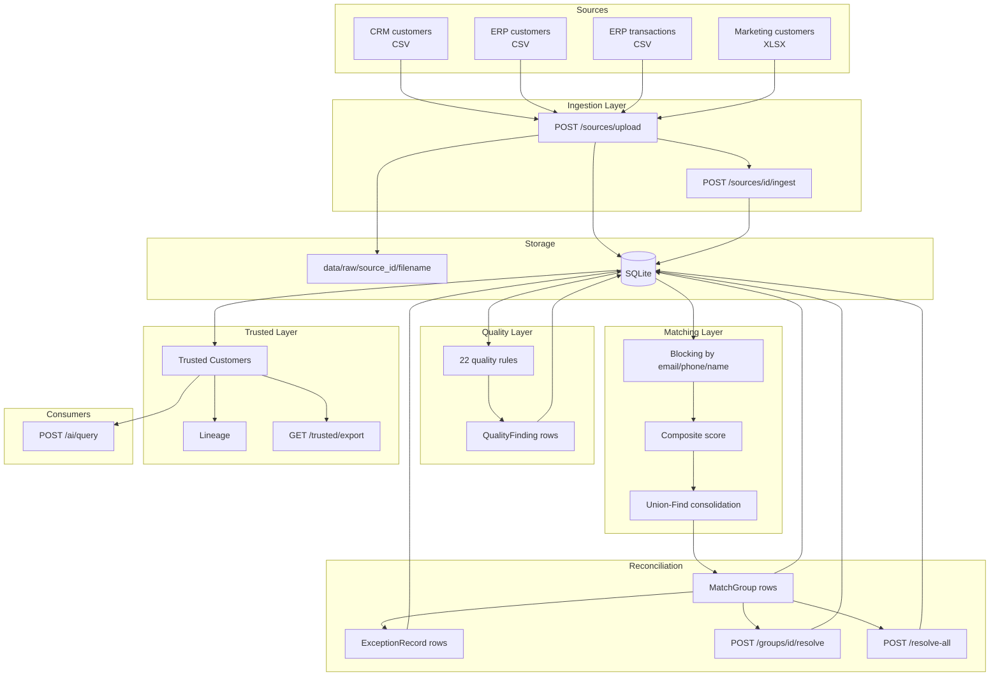

# DataQ — Architecture

## 1. System Overview

DataQ is a layered data pipeline with a strict separation between *raw* and *trusted* data:

```
Sources → Ingestion → Quality → Matching → Reconciliation → Trusted → Consumers
           ↓          ↓          ↓            ↓                 ↓
        (raw files) (findings) (groups)    (decisions)    (AI, exports)
           └──────────────┬───────────────┴─────────────────┘
                    Audit Trail (append-only)
```

Every state transition writes an immutable `AuditEvent` with `before_state` and `after_state`.

---

## 2. Data Flow Diagram



---

## 3. Record State Machine

Every record progresses through:

```
Raw → Profiled → Quality Checked → Matching → In Review → Trusted → Archived
```

| State | Meaning | Transition trigger |
|-------|---------|-------------------|
| `raw` | File uploaded, nothing parsed | `POST /sources/upload` |
| `profiled` | Parsed, rows inserted, profile computed | `POST /sources/{id}/ingest` |
| `quality_checked` | Rules have run against this record | `POST /quality/run` |
| `matching` | A MatchGroup references this record | `POST /reconciliation/run` |
| `in_review` | Group is `needs_review` | MatchGroup creation |
| `trusted` | Record was chosen as survivor | `POST /reconciliation/groups/{id}/resolve` |
| `archived` | Duplicate, linked to a survivor | Resolve action |

---

## 4. Component Responsibilities

### Ingestion (`services/ingestion.py`)
- Detect file type (CSV / XLSX)
- Normalize column names against canonical mapping
- Route to Customer or Transaction table based on filename + source_system
- Compute per-column profile: dtype, null count, null %, unique count, samples
- Write `source.uploaded` and `source.ingested` audit events

### Quality Engine (`services/quality_engine.py`)
- Implements all 22 rules from Phase 0 Section 7
- One rule = one self-contained query, returning offending rows
- One `QualityFinding` per (rule, record) pair
- Rule families:
  - Completeness: COMP-01 … COMP-06
  - Validity: VAL-01 … VAL-06
  - Uniqueness: UNIQ-01 … UNIQ-03
  - Consistency: CONS-01 … CONS-05
  - Anomaly: ANOM-01, ANOM-02
- Writes one `quality.run` audit event per execution

### Matching Engine (`services/matching.py`)
- Blocking by normalized email, phone (last 9 digits), or name token
- Composite score per Phase 0 Section 8.1:
  ```
  score = 0.35*email + 0.25*phone + 0.25*name + 0.10*dob + 0.05*city
  ```
- Strong-match shortcuts: email+phone=0.99, email=0.98, phone+lastname=0.95
- Thresholds: ≥0.90 probable, 0.75–0.89 possible, <0.75 no match
- Union-Find transitive consolidation → one group per true entity
- Writes one `matching.run` audit event per execution

### Survivorship (`services/survivorship.py`)
- Source priority: ERP > CRM > MKT
- Fallback: most recent update, then non-null, then field-level preference
- Human override always wins (when provided)

### Trusted Data (`services/trusted.py`)
- Trusted customers = `is_trusted = True`
- Lineage = self + all records pointing at this survivor via `trusted_customer_id`
- CSV export flattens lineage
- Transactions linked by `customer_id` (post-MVP)

### AI Analyst (`services/ai_analyst.py`)
- Rule-based stub (no LLM) — answers by pattern-matching common questions
- Reads **only** from the trusted store
- Refuses when it cannot ground an answer (`matched_rule: refuse_unrecognized`)
- Every query logged to audit trail

### Audit (`api/audit.py`)
- Read-only endpoints over the append-only `AuditEvent` table
- Filters: event_type, entity_type, entity_id, actor, since, limit
- Per-record history: `GET /audit/record/{id}`

---

## 5. Database Schema (core tables)

| Table | Purpose | Key columns |
|-------|---------|-------------|
| `sources` | Uploaded files | id, source_system, status, row_count, stored_path, profile_json |
| `customers` | Raw + trusted customer records | id, source_id, source_system, source_customer_id, full_name, email, phone, dob, is_trusted, trusted_customer_id |
| `transactions` | Raw transaction records | id, source_id, source_customer_id, transaction_date, amount, currency, customer_id |
| `quality_findings` | One row per rule violation | rule_id, entity_type, record_id, severity, message, evidence, status |
| `match_groups` | Consolidated match candidates | match_type, confidence_score, record_ids (JSON), evidence (JSON), status, proposed_surviving_id |
| `exceptions` | Cases needing human judgment | exception_type, severity, status, related_record_ids, group_id, resolution_* |
| `audit_events` | Append-only history | event_type, entity_type, entity_id, actor, action, before_state, after_state |

---

## 6. Business Rules (Phase 0 Section 13)

1. Records with open Critical findings cannot enter the Trusted store.
2. Every change to a trusted record creates an immutable audit event.
3. Human decisions always override system suggestions.
4. AI Analyst may only read from the Trusted store.
5. Source raw data is never modified.
6. Match groups and exceptions remain queryable after resolution.

---

## 7. API Surface

| Layer | Endpoints |
|-------|-----------|
| Sources | `GET /sources`, `POST /sources/upload`, `POST /sources/{id}/ingest`, `GET /sources/{id}` |
| Quality | `POST /quality/run`, `GET /quality/findings`, `GET /quality/findings/{id}`, `GET /quality/summary` |
| Reconciliation | `POST /reconciliation/run`, `GET /reconciliation/groups`, `GET /reconciliation/groups/{id}`, `POST /reconciliation/groups/{id}/resolve`, `POST /reconciliation/resolve-all` |
| Trusted | `GET /trusted/customers`, `GET /trusted/customers/{id}`, `GET /trusted/transactions`, `GET /trusted/export` |
| AI | `POST /ai/query` |
| Audit | `GET /audit`, `GET /audit/record/{id}`, `GET /audit/summary` |
| Health | `GET /`, `GET /health`, `GET /api/info` |

---

## 8. Design Decisions

**Why rule-based first?**
Phase 0 principle: strong non-ML baseline before ML. Every rule is independently testable against the injected ground truth. ML (matching classifier, anomaly detection) layers on top and its lift can be measured.

**Why union-find?**
Naive pairwise matching produces C(N,2) groups per entity. For a 3-source customer, that's 3 groups instead of 1. Union-find collapses them.

**Why SQLite for MVP?**
Zero-config, portable, adequate for 500–5000 rows. Schema is PostgreSQL-compatible when scale demands it.

**Why an audit trail?**
The spec's core value is "explainable and audit-ready." Without immutable history, "trusted" is just a claim. Every state transition writes to `AuditEvent` before commit.

**Why a rule-based AI Analyst?**
MVP constraint: no LLM key, no rate limits, no hallucinations. The stub returns grounded answers with the exact metric that produced them. Swapping in an LLM later is a 20-line change: replace `_answer()` with an LLM call receiving the same trusted-data context.